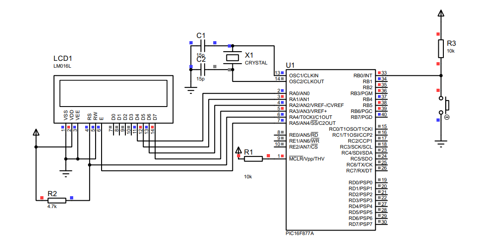

# PIC16F877A Calculator

 
🔗 | [Project Statment](docs/project.pdf)  
🔗 | [Design](docs/design.pdf)  
🔗 | [Data Sheet](docs/datasheet.pdf)  
🔗 | [Interfacing LCD](docs/lcd.pdf)  

## Description
A PIC16f877A based calculator that can perform basic arithmetic operations (Addition, Division, and Modulo) and displays the result on a 16x2 LCD Screen interfaced with only 1 push button, written in PIC assembly `main.asm`.

## Circuit Design

